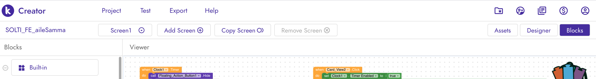
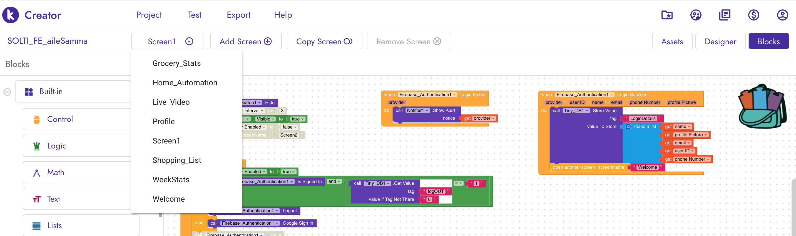
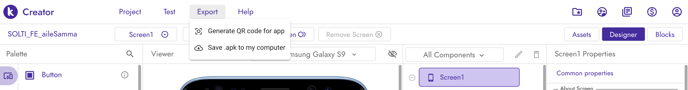

# HoMart - "Smart Kitchen App/Tech" 
## ( Developer: Ankit Shah )

HoMart is a smart kitchen assistant Android App that can notify the amount of groceries in home, auto/manually update items on cart, show weekly consumption analysis and control kitchen appliances from anywhere online. In our busy life sometimes its very difficult to keep track of groceries and when we go for shopping we might forget to buy some items. There are many things around in the kitchen that might have expired or is nearing expiry that we might not notice. So HoMart app lets you know how much groceries you have based upon the weight of the groceries. 

The HoMart app communicates in real time with the "Smart Kitchen Device" that senses the weight of groceries and tracks the changes in weight everyday and sends the data to the app. User can set the threshold to notify when the groceries are low, ( ie: if there is 7.5lbs Apples and if the user sets the threshold 3lbs then user will be notified when the grocery is low updating the shopping cart). Also having the capability to remind user to check if certain food is expired or not (ie: if the user sets the expiry date to be 4 days of the grocery then the user will be notified on 4th day onwards about the item) by detecting the weight change in the user defined time period.

App also graphs the weekly consumption of each groceries so it will let users know the pattern of their diet, consumption status and items they rarely use. So, next time when they go for shoppping it will help them to "Shop Smart".

Imagine waking up with the coffee ready in the moring when we go to the kitchen, yes HoMart has the feature to control kictchen applicances and set timers when to switch on/off the device from anywhere online. Also, if you forget to turn off the kitchen applicances or lights now you can switch it off from anywhere if you are not home. 

App also has voice recognition feature, so you can just press mic icon and say " Add milk and bread " and the groceries milk and bread will be added to the shopping wish list. Also, you can manually add/remove the items from the wish list.

HoMart is a complete package to assist users of the kitchen.

## Getting Started

The app was built from MIT web based app development framework called [Kodular.io](https://www.kodular.io/). Its a drag and drop online app development framework. So in order to compile the **.aia** file create an account by clicking on Create Apps on [Kodular.io](https://www.kodular.io/).

### Importing .aia file to Kodular Server

When signup is complete, there is an option for **Import Project** on the Kodular dashboard. Simply, upload the .aia file and the screen appears with the frontend design of the app loaded. The frontend design is in the **Designer** tab as seen below. 


```
All the fronend components that was used to build the app can be seen here.
```
 The backend and coding part is in the **Blocks** tab as seen below.
 
 
 
```
All the codes that was used to build the app can be seen here.
```

### Switching Screens

There are 8 screens in the app. In order to view codes on each screen press the dropdown menu on tab called **Screen1** as shown below. 



```
Swicthing screen from the drop down menu can help view the codes and frontend design of each screen.
```

## Packaging .apk file

In order to package and export the **.apk** file go to export tab and on the drop down menu select *"Save .apk to my computer"*. The file will be automatically downloaded and can be installed on the android smartphone.



### Break down into end to end tests

Explain what these tests test and why

```
Give an example
```

### And coding style tests

Explain what these tests test and why

```
Give an example
```

## Deployment

Add additional notes about how to deploy this on a live system

## Built With

* [Dropwizard](http://www.dropwizard.io/1.0.2/docs/) - The web framework used
* [Maven](https://maven.apache.org/) - Dependency Management
* [ROME](https://rometools.github.io/rome/) - Used to generate RSS Feeds

## Contributing

Please read [CONTRIBUTING.md](https://gist.github.com/PurpleBooth/b24679402957c63ec426) for details on our code of conduct, and the process for submitting pull requests to us.

## Versioning

We use [SemVer](http://semver.org/) for versioning. For the versions available, see the [tags on this repository](https://github.com/your/project/tags). 

## Authors

* **Billie Thompson** - *Initial work* - [PurpleBooth](https://github.com/PurpleBooth)

See also the list of [contributors](https://github.com/your/project/contributors) who participated in this project.

## License

This project is licensed under the MIT License - see the [LICENSE.md](LICENSE.md) file for details

## Acknowledgments

* Hat tip to anyone whose code was used
* Inspiration
* etc

