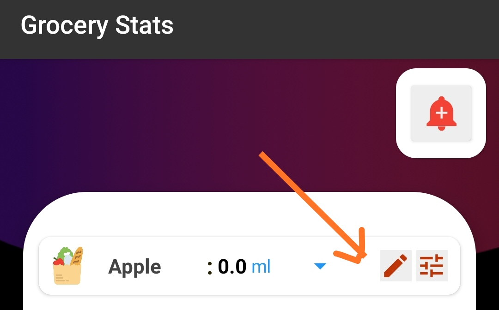
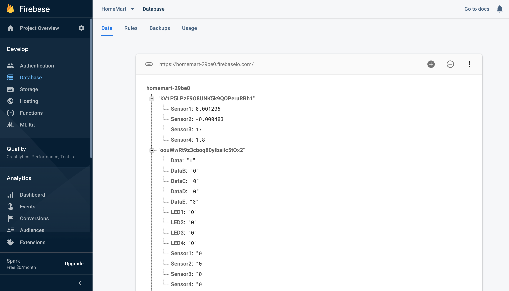
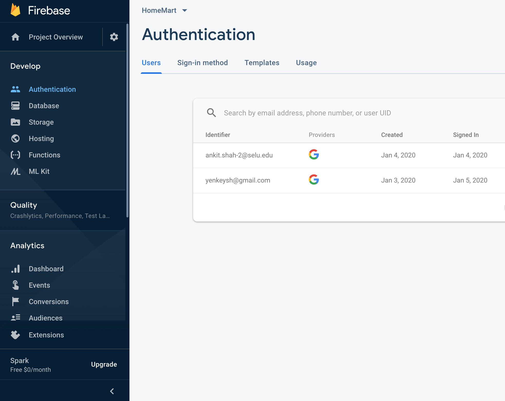

# HoMart - "Smart Kitchen App/Tech" 
## ( Developer: Ankit Shah )

**HoMart** is a smart kitchen assistant Android App that can notify the amount of groceries in home, auto/manually update items on cart, show weekly consumption analysis and control kitchen appliances from anywhere online. In our busy life sometimes its very difficult to keep track of groceries and when we go for shopping we might forget to buy some items. There are many things around in the kitchen that might have expired or is nearing expiry that we might not notice. So HoMart app lets you know how much groceries you have based upon the weight of the groceries. 

The HoMart app communicates in real time with the **"Smart Kitchen Device"** that senses the weight of groceries and tracks the changes in weight everyday and sends the data to the app. User can set the threshold to notify when the groceries are low, ( ie: if there is 7.5lbs Apples and if the user sets the threshold 3lbs then user will be notified when the grocery is low updating the shopping cart). Also having the capability to remind user to check if certain food is expired or not (ie: if the user sets the expiry date to be 4 days of the grocery then the user will be notified on 4th day onwards about the item) by detecting the weight change in the user defined time period.

App also graphs the weekly consumption of each groceries so it will let users know the pattern of their diet, consumption status and items they rarely use. So, next time when they go for shoppping it will help them to "Shop Smart".

Imagine waking up with the coffee ready in the moring when we go to the kitchen, yes HoMart has the feature to control kictchen applicances and set timers when to switch on/off the device from anywhere online. Also, if you forget to turn off the kitchen applicances or lights now you can switch it off from anywhere if you are not home. 

App also has voice recognition feature, so you can just press mic icon and say " Add milk and bread " and the groceries milk and bread will be added to the shopping wish list. Also, you can manually add/remove the items from the wish list.

HoMart is a complete package to assist users of the kitchen.

## Getting Started

The app was built from MIT web based android app development framework called [Kodular.io](https://www.kodular.io/). Its a drag and drop online app development framework. There are two ways to install the app: Either just download **HoMart.apk** directly and follow *Installation and Deployment* instructions below or follow the steps below how to parse the **.aia** file. In order to compile the **.aia** file create an account by clicking on Create Apps on [Kodular.io](https://www.kodular.io/).

### Importing .aia file to Kodular Server

When signup is complete, there is an option for **Import Project** on the Kodular dashboard. Simply, upload the .aia file and the screen appears with the frontend design of the app loaded. The frontend design is in the **Designer** tab as seen below. 


```
All the frontend components that was used to build the app can be seen here.
```
 The backend and coding part is in the **Blocks** tab as seen below.
 
 
 
```
All the codes that was used to build the app can be seen here.
```

### Switching Screens

There are 8 screens in the app. In order to view codes on each screen press the dropdown menu on tab called **Screen1** as shown below. 


```
Swicthing screen from the drop down menu can help view the codes and frontend design of each screen.
```

## Packaging .apk file

In order to package and export the **.apk** file go to export tab and on the drop down menu select *"Save .apk to my computer"*. The file will be automatically downloaded and can be installed on the android smartphone.


## Installation and Deployment

* If the phone doesnt allow installation from unknown sources make sure to allow installation from unkonwn sources that can be changed from smartphone settings.
* After installing the App has **Google Authentication** system that is linked to Google Firebase. So, new users can login using their google account linked to their phone or sign up using new account. 
* When the Dashboard loads with pop up screen, please *allow HoMart to access photos, media and files on your device*. This is because the user data is stored in the users smart phone storage.  
* Make sure you have internet connection available. App wont function correctly unless you have internet connection. Now the app is ready to use.

## App Functionality

### Dashboard
1) Daily overview of items on cart, Number of expiring items and number of appliances swithched on.
2) Buttons with Link to the different screens.
3) Update Shopping List button from which user can add groceries to the wish list. For Ex. By saying "Add Coffee"
4) Bottom Navigation Bar to navigate through different menu.

### Grocery Stats
1) You can update the grocery name from the *Pen* icon located on right.
2) You can set the threshold of the grocery by clicking on icon located just right of *Pen* icon. 
   - if there is 7.5lbs Apples in kitchen and if you set the threshold to 3lbs then you will be notified when the grocery is      low updating the shopping cart
3) The Notification icon: if the weight of the groceries falls below the set threshold the color of Notification icon will      turn *red* else it will be *black*. Pressing the icon opens up the Shopping List page.



### Weekly Stats
1) The weekly stats screen contains line graph and bar graph under weekly consumption tab. 
2) The Consumption report tab consists of Average usage of each groceries on the sensors in the week till that day. 
3) It also shows for how many days items were not used if the weight on the sensor doesnt changes. 
   - By default user will be notified in 3 days to alert user if the item is about to expire. Else Expiry/Alert day can be        updated from *Items about to Expire this week?* button.

### Shopping List
1) Under Low Groceries tab, users get all the item in the cart that are low in the kitchen. (are less than the user set threshold).
2) Under Wish List tab, users can add/remove the groceries on the shopping List. 
   - This is the tab where users get the groceries added by the voice recognition button on Dashboard.
   
### Home Automation
1) Under Home Automation, users can switch on/off the appliances connected to the **Smart Kitchen Device**.
2) Set Timer to on/off the appliances.
3) Completed Task is underdevelopment so, it will be developed in the future.

### Kitchen Live
- This is an experimental feature which will give the video of the kitchen to monitor the activities like cooking, fire,and   so on. It will be developed in the future.

## Resources / Technologies used in the App

* [Kodular.io](http://kodular.io) - The web based app development framework
* [Google Firebase](https://firebase.google.com) - Online Database to get the sensor data from Smart Kitchen device and for   user Authentication from Google.
* [Material Icons](https://material.io/resources/icons/?icon=create&style=baseline) - Icons in App

## Resources / Technologies used in the Smart Kitchen Device

* Arduino Compiler V1.6.9
* Google Firebase
* HX711 weight sensors
* WeMos D1 - programmable ESP8266 microcontroller
* NodeMCU -programmable ESP8266 microcontroller

## Libraries / Extensions Used

* Chartmaker - Beautiful chart making (App)
* ListView - organized list view on Wish List tab (App)
* HX711 library - to get the sensor data (Device)
* Arduino Firebase library - to push/get data from database (Device)

## Security Awareness/Concerns Addressed in App

* This app currently supports Android system, so almost all users have google account linked to phone, so here user Login Authentication is done through Google Firebase Authentication system, which only provides name, email, userID and photo of the users. Password is not needed to sign in as verfication is already done by google.
* The Sensor data is pushed to Google firebase storage using userID provided by google so the name of the user is not stored in the online databse. 
* All the name of the groceries are saved inside the users smartphone storage so there is no data leak of the type of         groceries used by the user. The online data base just gets the numbers based on *Sensor1: 6.7, Sensor2: 8.4, Sensor3: 55.3..."*.

```
Shown below is how Firebase Database looks like with the userID provided by Google.
```


## Test Accounts
```
Shown below is the Test accounts that signed in and succesfully got the sensor data, and could communicate with the smart kicten device throgh app.
```



## Author Bio / Contact Info

* **Ankit Shah** - *Undergraduate in CS and Electrical Engineering* 
  - Ankit is an enthusiast in combining knowledge of CS and Electrical engineering together. He has devloped technologoies like Brain Computer Interface, Smart Pedical Probe, Voice Controlled Home Automation System, and many more disability assistant technologies. His passion is to help disbled people with the smart assistant technologies and he has his personal project going on currently.
  
* If you have any questions or concerns please feel free to **Contact:** -  ankit111@unm.edu 


